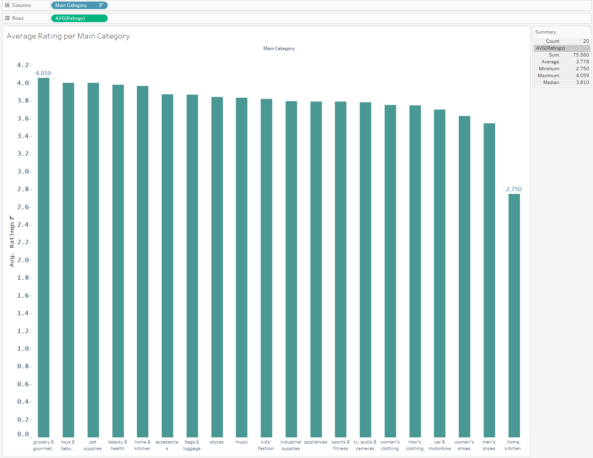

# Week 3 Assignment: Data Visualisation and Communication
#### Documentation on Week_3_ANSWER_DEAS_123 python file

## Problem Formulation
The objective of this analysis is to understand product performance across various categories based on customer feedback and pricing. Using data from Amazon, we aim to provide insights into customer satisfaction, pricing trends, and engagement (as measured by the number of reviews). These insights will help stakeholders optimise product offerings, improve pricing strategies, and target promotions to increase sales and customer satisfaction.

## Data Collection
The data used for this analysis includes:
- **Main product categories** and **subcategories**.
- **Customer ratings** for each product.
- **Number of customer ratings** (as an indicator of customer engagement).
- **Discounted price** and **original price** for each product.

## Data Quality
The dataset appears clean and usable, with no significant missing data or outliers affecting the core metrics. The data includes enough variety across product categories to provide meaningful insights for Amazon's product portfolio.

## Data Analysis and Visualisations
Produced four visualisations to explore key relationships and trends in the data, using both Seaborn and Plotly libraries.

### 1. Bar Chart: Average Rating by Product Category
This visualisation shows the average customer satisfaction (ratings) across various product categories.

- **Why this graph?** Bar charts are effective for comparing discrete categories, and the average rating gives a clear picture of customer satisfaction within each category.
- **Relevance to clients** Helps stakeholders identify which categories perform best in terms of customer satisfaction. Categories with low average ratings may need improvements or better marketing strategies to boost sales.

### 2. Box Plot: Ratings Distribution by Category
The box plot visualises the spread of customer ratings across different product categories.

- **Why this graph?** Box plots are useful for showing the range and distribution of data, highlighting variability within categories.
- **Relevance to clients** A category with a wide range of ratings may indicate inconsistent product quality or customer experiences, while a narrower range suggests more consistent satisfaction. This helps stakeholders identify categories that need quality improvements.

### 3. Histogram: Distribution of Discounted Prices
This histogram displays how product prices (after discounting) are distributed.

- **Why this graph?** Histograms are ideal for understanding the distribution of continuous data, in this case, the prices.
- **Relevance to clients** Knowing how prices are distributed across the product range allows Amazon to understand if certain price points are over- or under-represented, helping them adjust their pricing strategy to meet customer demand at various price levels.

### 4. Scatter Plot: Number of Ratings vs. Discounted Price
This scatter plot explores the relationship between the number of customer ratings and the discounted price of products.

- **Why this graph?** Scatter plots are great for showing relationships between two numerical variables.
- **Relevance to clients** This graph can reveal if products with greater discounts receive more customer attention (via ratings), which can inform Amazon's strategy to increase customer engagement by offering competitive discounts.

## Conclusions and Recommendations
1. **Customer Satisfaction** The bar chart indicates that some product categories consistently receive higher ratings than others. Amazon should focus on promoting these well-rated categories while investigating the reasons behind lower-rated categories to improve product quality or customer experience.
   
2. **Product Consistency** The box plot shows that certain categories have a wide spread of ratings, suggesting inconsistency in customer satisfaction. These categories should be further analysed to pinpoint the reasons for variability (e.g., issues with specific products or vendors).

3. **Pricing Strategy** The histogram reveals the distribution of prices after discounts, which can help Amazon identify if certain price ranges are being underutilised. Adjusting pricing strategies within these gaps could increase accessibility to customers.

4. **Customer Engagement** The scatter plot shows the relationship between price discounts and the number of customer reviews. If a strong correlation exists between discounts and increased reviews, Amazon could consider offering strategic discounts to boost engagement and gather more customer feedback.

## Tableau:

This bar chart visualizes the average customer ratings for products within different main product categories. Each bar represents the average rating of products within a specific category, providing an easy-to-understand comparison of customer satisfaction across categories.

***Key Elements in the Chart:***

    X-axis (Categories)
    Y-axis (Average Ratings): The y-axis represents the average customer rating for products in each category.
    
    Bar Height: The height of each bar corresponds to the average rating for that category. Taller bars indicate higher customer satisfaction, while shorter bars suggest lower satisfaction.
    
    Highlighted Ratings: Some ratings are displayed on top of the bars to provide clarity on the exact average for the highest and lowest categories (e.g., 4.059 for "grocery & gourmet" and 2.750 for "home, kitchen").

***Insights from the Visualisation:***

    Highest-Rated Category:
    The "grocery & gourmet" category has the highest average rating (4.059), suggesting that customers are most satisfied with products in this category.

    Lowest-Rated Category:
    The "home, kitchen" category has the lowest average rating (2.750), indicating relatively lower customer satisfaction.

    Uniformity Across Categories:
    Most categories have relatively high ratings (around 3.7-4.0), which indicates a generally positive customer experience across a broad range of product types.

---
---